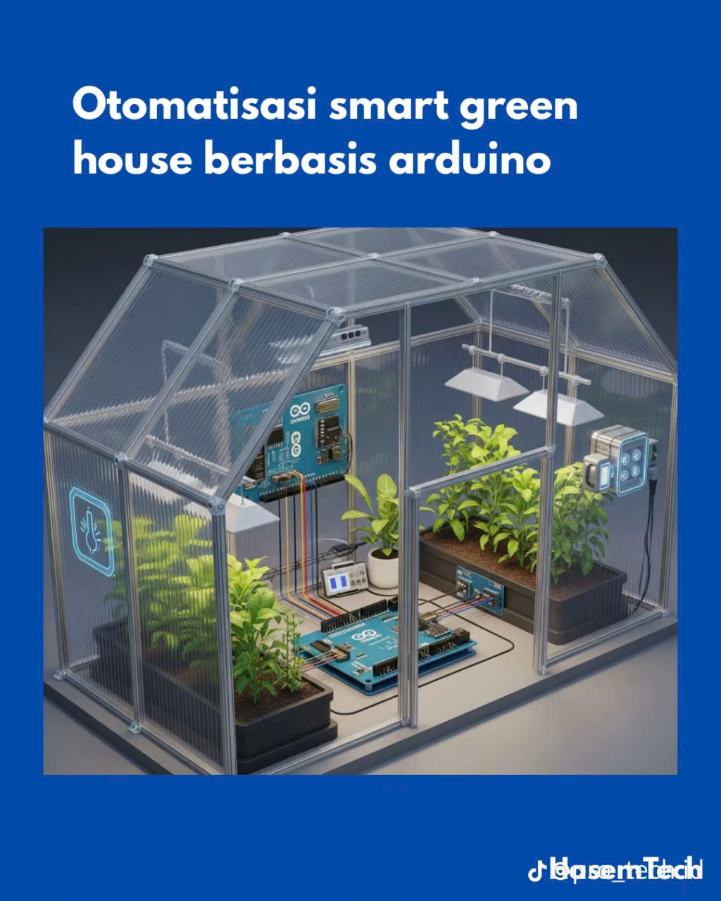

# 🌱 Smart Greenhouse System

[](https://github.com/Thanhtan2108/PROJECT-WITH-ARDUINO)
[](LICENSE)
[](https://github.com/Thanhtan2108/PROJECT-WITH-ARDUINO)
[](https://www.arduino.cc/)
[](https://platformio.org/)

> **Hệ thống nhà kính thông minh tự động điều khiển môi trường trồng cây sử dụng Arduino**

---

## 📸 Hình ảnh Project



---

## 🎯 Mô tả ngắn gọn

Smart Greenhouse là một hệ thống tự động hóa hoàn chỉnh để quản lý môi trường trồng cây trong nhà kính. Hệ thống sử dụng các cảm biến thông minh để theo dõi điều kiện môi trường và tự động điều khiển các thiết bị để duy trì điều kiện tối ưu cho cây trồng, giúp tăng năng suất và giảm thiểu sự can thiệp của con người.

---

## 📖 Giới thiệu chi tiết

### **Lý do tạo ra project**

Trong nông nghiệp hiện đại, việc duy trì môi trường trồng cây tối ưu là vô cùng quan trọng. Tuy nhiên, việc theo dõi và điều chỉnh thủ công các thông số như nhiệt độ, độ ẩm, ánh sáng và độ ẩm đất không chỉ tốn thời gian mà còn có thể không chính xác. Smart Greenhouse được thiết kế để giải quyết vấn đề này.

### **Vấn đề mà project giải quyết**

- **Tự động hóa**: Loại bỏ sự can thiệp thủ công hàng ngày
- **Độ chính xác**: Cảm biến chính xác hơn so với cảm nhận của con người
- **Tiết kiệm thời gian**: Giảm thời gian chăm sóc cây trồng
- **Tối ưu hóa**: Duy trì điều kiện môi trường lý tưởng 24/7
- **Tiết kiệm tài nguyên**: Chỉ sử dụng nước và điện khi cần thiết

---

## 🔧 Tính năng chính

### **1. Điều khiển thông minh**

- 🌡️ **Quạt thông gió**: Tự động bật khi nhiệt độ ≥ 30°C hoặc độ ẩm ≥ 80%
- 💧 **Bơm nước**: Tự động tưới khi độ ẩm đất thấp (ADC ≤ 450)
- 💡 **Đèn LED trồng cây**: Tự động bật khi ánh sáng yếu (≤ 1500 lux)

### **2. Bảo vệ an toàn**

- ⏰ **Timer bơm nước**: Tự động tắt sau 30 giây để tránh ngập úng
- ✅ **Validation dữ liệu**: Kiểm tra tính hợp lệ của tất cả cảm biến
- 🔄 **Fallback values**: Sử dụng giá trị cuối cùng hợp lệ khi cảm biến lỗi

### **3. Monitoring & Logging**

- 📊 **Serial Monitor**: Log chi tiết tất cả dữ liệu và trạng thái
- 🖥️ **LCD Display**: Hiển thị thông tin cơ bản thời gian thực
- ⚠️ **Error Detection**: Phát hiện và báo cáo lỗi cảm biến

---

## 🛠️ Yêu cầu hệ thống

### **Phần cứng (Hardware)**

- **Arduino Uno** hoặc tương thích
- **Cảm biến DHT22** - Đo nhiệt độ và độ ẩm không khí
- **Cảm biến DS18B20** - Đo nhiệt độ đất (tùy chọn)
- **Cảm biến YL-69** - Đo độ ẩm đất
- **Cảm biến BH1750** - Đo cường độ ánh sáng
- **LCD I2C 16x2** - Hiển thị thông tin
- **Quạt thông gió** với Relay điều khiển
- **Bơm nước** với Relay điều khiển
- **Đèn LED trồng cây** với Relay điều khiển
- **Breadboard và dây kết nối**
- **Nguồn cung cấp 5V cho Arduino, 3.3V cho cảm biến, 12V cho bơm**

### **Phần mềm (Software)**

- **Arduino IDE** hoặc **PlatformIO**
- **Thư viện Arduino**:
  - `DHT sensor library` (v1.4.6+)
  - `Adafruit Unified Sensor` (v1.1.15+)
  - `OneWire` (v2.3.8+)
  - `DallasTemperature` (v4.0.4+)
  - `BH1750` (v1.3.0+)
  - `LiquidCrystal_I2C` (v1.1.4+)

---

## 🔌 Sơ đồ kết nối

```text
Arduino Uno:
├── Pin 4  → DHT22 (Temperature & Humidity)
├── Pin 5  → DS18B20 (Soil Temperature)
├── Pin A0 → YL-69 (Soil Moisture)
├── Pin 9  → Fan Control (Relay)
├── Pin 10 → Water Pump (Relay)
├── Pin 11 → Grow LED (Relay)
├── SDA    → LCD I2C + BH1750
└── SCL    → LCD I2C + BH1750
```

---

## 📊 Cấu hình ngưỡng

```cpp
// Nhiệt độ (°C)
TEMP_ON_THRESHOLD = 30.0, TEMP_OFF_THRESHOLD = 28.0

// Độ ẩm không khí (%)
HUMIDITY_ON_THRESHOLD = 80.0, HUMIDITY_OFF_THRESHOLD = 75.0

// Độ ẩm đất (ADC raw 0-1023)
SOIL_DRY_THRESHOLD = 450, SOIL_WET_THRESHOLD = 650

// Ánh sáng (lux)
LIGHT_LOW_THRESHOLD = 1500, LIGHT_HIGH_THRESHOLD = 2000
```

---

## 🚀 Cài đặt và sử dụng

### **1. Clone project**

```bash
git clone https://github.com/Thanhtan2108/PROJECT-WITH-ARDUINO.git
cd PROJECT-WITH-ARDUINO/Smart_Greenhouse
```

### **2. Cài đặt PlatformIO**

- Cài đặt [PlatformIO IDE](https://platformio.org/install/ide?install=vscode) cho VS Code
- Hoặc cài đặt [PlatformIO Core](https://platformio.org/install/cli)

### **3. Kết nối phần cứng**

- Kết nối các cảm biến theo sơ đồ kết nối
- Kiểm tra địa chỉ I2C của LCD (0x27 hoặc 0x3F) và BH1750 (0x23 hoặc 0x5C)
- Đảm bảo nguồn cung cấp đúng điện áp

### **4. Upload code**

```bash
pio run --target upload
```

### **5. Monitor Serial**

```bash
pio device monitor
```

---

## 📈 Monitoring & Output

### **Serial Output**

```text
=== Smart Greenhouse System ===
System initialized successfully
Tair=25.6C  RH=65.2%  Tds=24.1C  Soil=512  Lux=1200 | Fan=0 Pump=0 Grow=1
```

### **LCD Display**

```text
T:25.6C H:65%
S:512 L:1200
```

---

## 🎛️ Tùy chỉnh

### **Điều chỉnh ngưỡng**

Thay đổi các giá trị trong file `src/config.h` để phù hợp với loại cây trồng:

```cpp
// Nhiệt độ
constexpr float TEMP_ON_THRESHOLD = 30.0;   // Giảm để quạt bật sớm hơn
constexpr float TEMP_OFF_THRESHOLD = 28.0;  // Tăng để quạt tắt sớm hơn

// Độ ẩm đất
constexpr int SOIL_DRY_THRESHOLD = 450;     // Giảm nếu bơm không chạy
constexpr int SOIL_WET_THRESHOLD = 650;     // Tăng nếu bơm không tắt
```

### **Thêm cảm biến mới**

1. Khai báo pin và thư viện trong `config.h`
2. Tạo hàm đọc cảm biến với validation trong `main.cpp`
3. Thêm logic điều khiển tương ứng

---

## 🔍 Troubleshooting

### **Lỗi thường gặp**

1. **DHT sensor error**

   - Kiểm tra kết nối dây (VCC→3.3V, GND→GND, DATA→Pin 4)
   - Thêm điện trở 4.7kΩ pull-up giữa DATA và VCC
   - Đảm bảo nguồn 3.3V ổn định

2. **LCD không hiển thị**

   - Kiểm tra địa chỉ I2C (0x27 hoặc 0x3F)
   - Kiểm tra kết nối SDA/SCL
   - Điều chỉnh contrast nếu cần

3. **Bơm nước không hoạt động**
   - Kiểm tra MOSFET/Relay
   - Đo điện áp tại pin 10 (5V khi ON, 0V khi OFF)
   - Kiểm tra nguồn cung cấp

---

## 🤝 Đóng góp

Mọi đóng góp đều được chào đón! Vui lòng:

1. **Fork** project này
2. Tạo **feature branch** (`git checkout -b feature/AmazingFeature`)
3. **Commit** changes (`git commit -m 'Add some AmazingFeature'`)
4. **Push** to branch (`git push origin feature/AmazingFeature`)
5. Tạo **Pull Request**

### **Guidelines cho đóng góp**

- Tuân thủ coding style hiện tại
- Thêm comments cho code mới
- Test kỹ trước khi submit
- Cập nhật documentation nếu cần

---

## 📝 License

Dự án này được phân phối dưới **MIT License**. Xem file [LICENSE](LICENSE) để biết thêm chi tiết.

**MIT License** cho phép:

- ✅ Sử dụng thương mại
- ✅ Sửa đổi
- ✅ Phân phối
- ✅ Sử dụng cá nhân
- ✅ Sử dụng riêng tư

**Yêu cầu duy nhất**: Giữ nguyên thông báo bản quyền và license.

---

## 👨‍💻 Tác giả

**Nguyễn Thanh Tân** - [@Thanhtan2108](https://github.com/Thanhtan2108)

- 📧 **Email**: [nthanhtan2004@gmail.com](mailto:nthanhtan2004@gmail.com)
- 🌐 GitHub: [@Thanhtan2108](https://github.com/Thanhtan2108)
- 📁 Repository: [PROJECT-WITH-ARDUINO](https://github.com/Thanhtan2108/PROJECT-WITH-ARDUINO)

---

## 🙏 Lời cảm ơn

- Cảm ơn cộng đồng Arduino và PlatformIO
- Cảm ơn các tác giả thư viện mã nguồn mở
- Cảm ơn tất cả những người đã đóng góp ý kiến và hỗ trợ

---

## 📞 Liên hệ & Hỗ trợ

Nếu bạn gặp vấn đề hoặc có câu hỏi:

- 📧 **Email**: [nthanhtan2004@gmail.com](mailto:nthanhtan2004@gmail.com)

---

⭐ Nếu project này hữu ích, hãy cho một star nhé! ⭐

🌱 Happy Growing! 🌱
